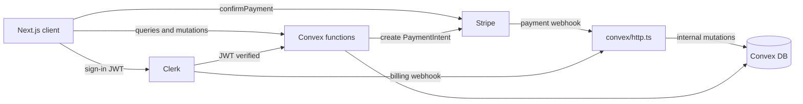

# Requirements

### Overview & Goals
FreshCart is a grocery shopping platform with two surfaces:
- **Client site** — customers browse, search, favorite, add to a persistent cart, check out with Stripe, and track their orders. Members (via Clerk Billing) get free delivery.
- **Admin site** — staff manage inventory (products/categories/stock), orders, and customers.

Goal for this iteration: **functionally complete MVP** with a simple, clean, modern UI (shadcn/ui + Tailwind). Visual polish is explicitly deferred.

### Scope
**In Scope**
- Persistent shopping cart (per signed-in user, stored in Convex, survives sessions/devices)
- Favourites (toggle + favourites page)
- Product detail page (image, description, price, stock state)
- Browse by category + full-text search
- Checkout flow: shipping address → Stripe Payment Element → order confirmation
- Reliable payment finalization via **Stripe webhook** (mark order paid, decrement stock, clear cart server-side)
- My Orders page + order detail with live status
- Membership via **Clerk Billing** (`<PricingTable />` page); members get **free delivery**, non-members pay a flat delivery fee
- Admin panel: products CRUD + stock management, category management, orders list + status updates, customers list; role-guarded
- Seed data (categories + products) for development
- Cleanup of dead code: Better Auth, Prisma, and broken snippets left in the repo
- Security hardening: all Convex functions derive identity from `ctx.auth` (no client-supplied `userId`), totals computed server-side

**Out of Scope**
- Guest (anonymous) carts — sign-in is required to add to cart (`sessionId` fields stay in schema for the future)
- Design revamp / branding, product reviews, coupons, delivery-slot scheduling, emails/notifications, multi-currency, image uploads (products use an image **URL** field for MVP)

### User Stories
- As a **shopper**, I can browse products by category and search by name so I can find groceries quickly.
- As a **shopper**, I can view a product's details and add it to my cart or favourites.
- As a **shopper**, my cart persists across sessions and devices.
- As a **shopper**, I can pay with a card via Stripe and immediately see my order with a live-updating status.
- As a **member**, I get free delivery on every order and can subscribe/manage my plan on a membership page.
- As an **admin**, I can create/edit/deactivate products, adjust stock, and see low-stock warnings.
- As an **admin**, I can view all orders, update their fulfillment status, and browse customers.

### Functional Requirements
1. **Catalog**: product grid with category filter chips and a working search input (≥3 chars triggers Convex search index). Out-of-stock products show a badge and disabled Add button.
2. **Cart**: add/increment/decrement/remove/clear; quantity capped by stock; header shows live item count.
3. **Checkout**: order is created server-side from the cart (prices & totals from DB, never from the client); shipping = **$5.99 flat**, **free for members**; PaymentIntent amount always equals server-computed total.
4. **Payment finalization**: `payment_intent.succeeded` webhook marks the order `paid`, decrements product stock, and clears the user's cart. The orders page shows "processing payment" until Convex reactivity flips the status.
5. **Orders**: "My Orders" lists the user's orders (items, totals, status). Admin can move status through `pending → paid → preparing → out_for_delivery → delivered` (or `cancelled`).
6. **Membership**: Clerk Billing plan (e.g. `plus`). Subscription webhook events sync `isMember` onto the Convex user; checkout and UI reflect free delivery instantly.
7. **Admin access**: only users with `role: 'admin'` can open `/admin/*` or call admin Convex functions; everyone else gets redirected/403.

### Non-Functional Requirements
- All order-money math and stock mutations happen in Convex (transactional, race-safe).
- Webhooks are signature-verified (Stripe signature; Clerk via Svix) and idempotent.
- Follows repo conventions: Next.js 16 (`proxy.ts`, App Router), Convex guidelines from `convex/_generated/ai/guidelines.md` (arg validators everywhere, internal functions for privileged ops), Biome lint clean.

# Technical Design

### Current Implementation
The stack is already chosen and wired — **Next.js 16 (App Router, React 19, Tailwind 4, shadcn/ui, Biome) + Convex (backend/DB) + Clerk (auth) + Stripe (payments)**:
- `convex/schema.ts` — full schema exists: `users`, `categories`, `products` (with `search_by_name` search index), `cartItems`, `favorites`, `orders`, `orderItems`, `addresses`.
- `convex/{cart,products,categories,favorites,orders,users,stripe}.ts` — most CRUD exists but **trusts client-supplied `userId`** and computes order totals on the client.
- Auth: `ClerkProvider` + `ConvexProviderWithClerk` in `app/layout.tsx` / `components/convex-clerk-provider.tsx` with an `AuthSync` upsert; `proxy.ts` runs `clerkMiddleware()`; `convex/auth.config.ts` points at Clerk.
- Pages built: `/shop` (buggy), `/product/[id]`, `/cart`, `/checkout` (+ `components/checkout/stripe-payment-form.tsx`). Empty dirs: `(shop)/favorites`, `(shop)/orders`, all of `(admin)/admin/*`.
- **Dead code**: `lib/auth.ts`, `lib/auth-client.ts`, `app/api/auth/[...all]/route.ts` (Better Auth) and `prisma/` — superseded by Clerk.
- **Known bugs found**: `categories.list` logic inverted (filters by `slug === 'test'` when `activeOnly !== true`); `/shop` imports `Link` from `lucide-react` and renders a search icon with **no input**, Add-to-cart button unwired; `components/auth-header.tsx` contains keyboard-mash garbage in JSX/className; cart quantity `<Input>` uses `onClick` to increment.
- **Progress**: `orders.createFromCart` is now correctly implemented (server-side pricing, stock validation, member shipping, `orderItems` snapshot, returns `{orderId, amountCents}`). However `convex/orders.ts` currently **cannot deploy**: it imports `requireUser` from `./lib/helpers` which doesn't exist yet, and carries junk imports (`import { undefined } from 'better-auth'`, `import { handler } from 'next/dist/build/templates/pages'`, unused `GenericMutationCtx`/`DataModel`). The old insecure `orders.create` (client-supplied prices) is still present.
- **Missing pipelines**: no `convex/http.ts` — payment success is only handled client-side (order `paymentStatus` never updates, stock never decrements); no membership integration (`isMember` unused, shipping hardcoded to 0).

### Key Decisions
1. **Keep the existing stack** (Next.js 16 + Convex + Clerk + Stripe + shadcn/ui). Remove Better Auth + Prisma leftovers and their deps. *Rationale: everything is already wired; smallest path to a working MVP.*
2. **Webhooks land on Convex HTTP actions (`convex/http.ts`)**, not Next.js API routes. Stripe events verified with `stripe.webhooks.constructEventAsync`; Clerk events verified with `svix` (per official Convex+Clerk docs — `verifyWebhook` from `@clerk/nextjs` can't run inside Convex). *Rationale: business logic (mark paid, decrement stock, sync membership) lives next to the data as internal mutations; no public Next.js routes needed; `proxy.ts` stays untouched.*
3. **Membership source of truth = `users.isMember` in Convex**, synced by Clerk Billing `subscription*` webhook events. Checkout shipping is computed in a Convex mutation from `isMember`. Client UI additionally uses Clerk's `has({ plan: 'plus' })` / `<Protect>` for instant display. *Rationale: shipping is money — must be decided server-side in Convex where the order is created.*
4. **Zero-trust Convex functions**: every user-scoped function derives the user from `ctx.auth.getUserIdentity()` via a shared `getCurrentUser(ctx)` helper; admin functions use `requireAdmin(ctx)` checking `users.role === 'admin'`. Client-supplied `userId` args are removed. *Rationale: current code lets any user read/clear any cart or create arbitrary-priced orders.*
5. **Order creation is fully server-side**: `orders.createFromCart` reads the cart, validates stock, computes subtotal/shipping/total from DB prices, and returns `{orderId, amountCents}` which feeds the PaymentIntent. *Rationale: client-computed totals are a payment exploit.* ✅ Implemented.
6. **Sign-in required to shop-actions** (cart/favorites/checkout). Guest browsing stays public. *Rationale: simplest correct persistent cart; schema keeps `sessionId` for a future guest flow.*
7. **Product images = URL string field** (`imageUrl`), no file uploads in MVP. Admin bootstrap via internal mutation `users.setRole` run with `npx convex run` (or Convex dashboard).

### Proposed Changes
**Convex backend**
- `convex/schema.ts`: products gain `description?`, `imageUrl?`, `unit?`; orders gain `paymentIntentId?` (indexed `by_payment_intent`); processed webhook events table `webhookEvents` (`eventId` indexed) for idempotency.
- `convex/lib/helpers.ts` (new): `getCurrentUser(ctx)`, `requireUser(ctx)`, `requireAdmin(ctx)`.
- `convex/cart.ts`, `convex/favorites.ts`: drop `userId` args; derive from auth; enforce stock caps; add `count` query for the header badge.
- `convex/orders.ts`: replace `create` with `createFromCart` (server totals + membership shipping + stock validation); `listByUser`/`getById` become auth-scoped (`listMine`, ownership check); add `internal.orders.markPaid` (sets `paymentStatus:'paid'`, `status:'paid'`, decrements stock, clears cart — single transaction); admin queries join customer info; `updateStatus` guarded by `requireAdmin` with a status whitelist.
- `convex/products.ts`: add new fields to `create`/`update`; add `listAdmin` (includes inactive), `remove` (soft-delete via `isActive:false`), `adjustStock`; all admin ops behind `requireAdmin`.
- `convex/categories.ts`: fix `list` bug (proper `isActive` filtering); add `update`; `create/update` behind `requireAdmin`.
- `convex/users.ts`: add `internal.users.setRole`, `internal.users.setMembership(clerkId, isMember)`, admin `listCustomers` (with order counts).
- `convex/stripe.ts`: `createPaymentIntent` action takes only `orderId: v.id('orders')`, loads the order server-side for the amount, stores `paymentIntentId` on the order (auth: order owner only).
- `convex/http.ts` (new): `POST /stripe` (verify signature → `internal.orders.markPaid` on `payment_intent.succeeded`, mark `failed` on `payment_intent.payment_failed`) and `POST /clerk-users-webhook` (Svix verify → `subscription.*`/`subscriptionItem.*` events → `internal.users.setMembership`; `user.deleted` cleanup). Both dedupe via `webhookEvents`.
- `convex/seed.ts` (new): `internalMutation` seeding ~6 categories and ~30 grocery products (run with `npx convex run seed:run`).

**Client site** (`app/(shop)/`)
- `layout.tsx` (new): store shell — header with logo, search box, nav (Shop, Favourites, Orders, Membership), live cart badge, `AuthHeader`.
- `shop/page.tsx`: fix imports (`next/link`), add a real search `<Input>`, responsive product grid via new `components/product-card.tsx` (image, price, stock badge, wired Add-to-cart + favourite toggle with sign-in redirect).
- `favorites/page.tsx` (new): grid of favourited products, remove + add-to-cart.
- `orders/page.tsx` (new): my orders with items/totals/status; "payment processing" state driven live by Convex reactivity; `orders/[id]/page.tsx` (new) detail view.
- `checkout/page.tsx`: call `orders.createFromCart` then `stripe.createPaymentIntent({orderId})`; show server-returned subtotal/shipping/total incl. "Free delivery — member" line.
- `components/checkout/stripe-payment-form.tsx` (attached file): remove client-side `clearCart({userId})` (webhook now clears it); keep `confirmPayment` + redirect to `/orders?success=true&orderId=…`.
- `membership/page.tsx` (new): Clerk `<PricingTable />` + current-plan status.
- `app/page.tsx`: simple landing hero linking to `/shop`; fix `auth-header.tsx` garbage.

**Admin site** (`app/(admin)/admin/`)
- `layout.tsx` (new): sidebar nav + role guard (redirect non-admins using `users.current.role`).
- `page.tsx` (new): mini dashboard (order counts, low-stock list).
- `products/page.tsx`: table with create/edit dialog (name, price, category, stock, unit, imageUrl, description, active), stock adjust, low-stock highlight; inline category management.
- `orders/page.tsx`: all orders with status filter + status-update select, customer + items detail.
- `customers/page.tsx`: users list with membership badge and order count.

**Cleanup**
- Delete `lib/auth.ts`, `lib/auth-client.ts`, `app/api/auth/`, `prisma/`; remove `better-auth`, `@prisma/client`, `prisma` deps from `package.json`.

### Data Models / Contracts
```ts
// convex/orders.ts
// ✅ Already implemented in convex/orders.ts:
export const createFromCart = mutation({
  args: { shippingAddress: v.object({ name: v.string(), street: v.string(), city: v.string(),
           state: v.string(), postalCode: v.string(), country: v.string(), phone: v.string() }) },
  returns: v.object({ orderId: v.id('orders'), amountCents: v.number() }),
  // handler: requireUser → load cart → validate stock → totals from DB prices (dollars)
  // shipping = user.isMember ? 0 : 5.99; amountCents = Math.round(total * 100)
});

export const markPaid = internalMutation({
  args: { paymentIntentId: v.string() },
  // find order by_payment_intent → patch paid → decrement each product's stock → clear user's cart
});

// convex/users.ts
export const setMembership = internalMutation({ args: { clerkId: v.string(), isMember: v.boolean() } });
```

### Architecture Diagram


### Environment / External Setup
- Convex deployment env: `STRIPE_SECRET_KEY`, `STRIPE_WEBHOOK_SECRET`, `CLERK_WEBHOOK_SECRET`, `CLERK_FRONTEND_API_URL` (existing).
- Next env: `NEXT_PUBLIC_CONVEX_URL`, `NEXT_PUBLIC_STRIPE_PUBLISHABLE_KEY`, Clerk keys (existing).
- Manual dashboard steps (documented in README): Stripe webhook endpoint → `https://<deployment>.convex.site/stripe`; Clerk webhook endpoint → `https://<deployment>.convex.site/clerk-users-webhook` (subscribe to subscription + user events); create Clerk Billing plan `plus` and enable Billing.

### Risks
- **Webhook race**: user lands on `/orders` before the webhook fires → mitigated by the live "processing payment" state (Convex reactivity updates in place).
- **Clerk Billing event shape** (`subscription.*` vs `subscriptionItem.*`) varies — handle both, key off plan slug, and log unknown events.
- **Oversell**: stock is validated at order creation and decremented at payment; brief window in between is acceptable for MVP (documented; a stock-reservation step is a future enhancement).
- **Next.js 16 conventions** differ from training data — consult `node_modules/next/dist/docs/` during implementation (async `params`, `proxy.ts`, etc.).

# Next Move

### GitHub push status
I committed all outstanding local changes on branch `feature/frontend` (commit `b4cfa61` — helpers, checkout page, `StripePaymentForm`, `convex/stripe.ts` scaffold, `auth-header.tsx`/shop fixes, plus `.junie` plan and `.idea` project files). **The push to `origin` (`https://github.com/oferdebug/freshcart.git`) failed** — this sandbox has no GitHub credentials configured (no cached HTTPS token, no SSH key, no `gh` CLI login), so `git push` can't authenticate. Run one of these from a machine/terminal that has your GitHub credentials:
```bash
cd freshcart
git push origin feature/frontend

# or, if you prefer to open a PR immediately:

gh pr create --fill --base main --head feature/frontend
```
Everything is committed and ready — only the network push needs your credentials.

### Where you are
✅ `orders.createFromCart` is **done and correct** — server-side pricing from `products`, stock validation, member shipping (`user.isMember ? 0 : 5.99`), `orderItems` snapshot, `amountCents` conversion. Nice work.

❌ But `convex/orders.ts` **cannot deploy yet** — two blockers, then three follow-ups. In order:

### Move 1 (do now): create `convex/lib/helpers.ts`
Line 7 of `orders.ts` imports `requireUser` from `./lib/helpers`, but **that file doesn't exist** (`convex/lib/` isn't even a directory). The Convex push fails until you add it. Users are looked up by `tokenIdentifier`, same as the existing `users.current` query:
```ts
// convex/lib/helpers.ts
import type { MutationCtx, QueryCtx } from '../_generated/server';

export async function getCurrentUser(ctx: QueryCtx | MutationCtx) {
  const identity = await ctx.auth.getUserIdentity();
  if (!identity) return null;
  return await ctx.db
    .query('users')
    .withIndex('by_token', (q) => q.eq('tokenIdentifier', identity.tokenIdentifier))
    .first();
}

export async function requireUser(ctx: QueryCtx | MutationCtx) {
  const user = await getCurrentUser(ctx);
  if (!user) throw new Error('Not signed in');
  return user;
}

export async function requireAdmin(ctx: QueryCtx | MutationCtx) {
  const user = await requireUser(ctx);
  if (user.role !== 'admin') throw new Error('Unauthorized: admin only');
  return user;
}
```

### Move 2 (do now): clean the top of `convex/orders.ts`
Delete these — junk imports that break the build/lint, none are used:
```ts
import { undefined } from 'better-auth';                    // ← delete (nonsense import)
import type { GenericMutationCtx } from 'convex/server';    // ← delete (unused)
import { handler } from 'next/dist/build/templates/pages';  // ← delete (Next build internals in Convex runtime)
import type { DataModel } from './_generated/dataModel';    // ← delete (unused)
```
Keep only:
```ts
import { v } from 'convex/values';
import { mutation, query } from './_generated/server';
import { requireUser } from './lib/helpers';
```
While you're in the file, **delete the old `orders.create` mutation** (lines ~63–118) — it trusts client-supplied items/prices/totals and is fully superseded by your `createFromCart`.

**Checkpoint:** `npx convex dev` pushes clean and `npx tsc --noEmit` passes.

### Move 3: schema additions (`convex/schema.ts`)
`createFromCart`'s downstream (PaymentIntent + webhook) needs these before you touch `stripe.ts`:
```ts
orders: defineTable({
  // ...existing fields...
  paymentIntentId: v.optional(v.string()), // new
})
  .index('by_user', ['userId'])
  .index('by_status', ['status'])
  .index('by_order_number', ['orderNumber'])
  .index('by_payment_intent', ['paymentIntentId']), // new

webhookEvents: defineTable({
  eventId: v.string(),
  source: v.string(), // 'stripe' | 'clerk'
  processedAt: v.number(),
}).index('by_event_id', ['eventId']),
```
Also add the product fields while you're here — all `v.optional`, non-breaking: `description?`, `imageUrl?`, `unit?`.

### Move 4: rework `convex/stripe.ts` to consume `createFromCart`
Your pasted file has two fatal problems: (1) an `export const createPaymentIntent = action({...})` **nested inside** the `createPaymentIntentMutation` handler — that's a syntax error, `export` can't appear inside a function body; and (2) it still takes a client-supplied `amount` — the same price-tampering exploit you just closed in `orders.createFromCart`. Delete `createPaymentIntentMutation` entirely and replace the whole file with one action whose amount always comes from the order in the DB:
```ts
// convex/stripe.ts
'use node';

import { v } from 'convex/values';
import Stripe from 'stripe';
import { internal } from './_generated/api';
import { action } from './_generated/server';

export const createPaymentIntent = action({
  args: { orderId: v.id('orders') },
  returns: v.object({ clientSecret: v.string() }),
  handler: async (ctx, args) => {
    const stripeSecretKey = process.env.STRIPE_SECRET_KEY;
    if (!stripeSecretKey) {
      throw new Error('STRIPE_SECRET_KEY is not configured');
    }

    // Owner-checked query — throws if the order isn't the caller's or isn't 'pending'.
    const order = await ctx.runQuery(internal.orders.getPendingOrderForPayment, {
      orderId: args.orderId,
    });

    const stripe = new Stripe(stripeSecretKey);
    const paymentIntent = await stripe.paymentIntents.create({
      amount: order.amountCents, // server-computed total, never trust the client
      currency: 'usd',
      metadata: { orderId: args.orderId },
      automatic_payment_methods: { enabled: true },
    });

    if (!paymentIntent.client_secret) {
      throw new Error('Failed to create payment intent');
    }

    // Persist so the webhook can find this order via `by_payment_intent`.
    await ctx.runMutation(internal.orders.attachPaymentIntent, {
      orderId: args.orderId,
      paymentIntentId: paymentIntent.id,
    });

    return { clientSecret: paymentIntent.client_secret };
  },
});
```
This needs two small `internal` helpers added to `convex/orders.ts` (actions can't touch `ctx.db` directly, only via `runQuery`/`runMutation`):
```ts
// convex/orders.ts (add alongside createFromCart)
export const getPendingOrderForPayment = internalQuery({
  args: { orderId: v.id('orders') },
  returns: v.object({ amountCents: v.number() }),
  handler: async (ctx, args) => {
    const order = await ctx.db.get(args.orderId);
    if (!order) throw new Error('Order not found');
    if (order.status !== 'pending') throw new Error('Order is not payable');
    return { amountCents: Math.round(order.total * 100) };
  },
});

export const attachPaymentIntent = internalMutation({
  args: { orderId: v.id('orders'), paymentIntentId: v.string() },
  returns: v.null(),
  handler: async (ctx, args) => {
    await ctx.db.patch(args.orderId, { paymentIntentId: args.paymentIntentId });
    return null;
  },
});
```
(Ownership: since `createFromCart` already stamped `userId` on the order and the client only ever passes back the `orderId` it just received, `getPendingOrderForPayment` is safe as an internal query called from the action's own trusted context — no extra `requireUser` check is needed here, but add one if you want defense-in-depth by passing the caller's identity through.)

Then wire `app/(shop)/checkout/page.tsx`: `createFromCart(...)` → `createPaymentIntent({ orderId })` → render `StripePaymentForm` with the `clientSecret`, showing the server-returned subtotal/shipping/total.

### Move 5: `internal.orders.markPaid` + `convex/http.ts` webhook
The payoff of Moves 3–4 — payment finalization (Delivery Step 4):
- Add `internal.orders.markPaid({ paymentIntentId })` to `orders.ts` (an `internalMutation`): find the order via `by_payment_intent` → patch `status:'paid'` + `paymentStatus:'paid'` → decrement each product's stock from its `orderItems` → clear the user's `cartItems`.
- Create `convex/http.ts` with a `POST /stripe` route: verify with `stripe.webhooks.constructEventAsync(body, sig, process.env.STRIPE_WEBHOOK_SECRET)`, dedupe via `webhookEvents`, handle `payment_intent.succeeded` / `payment_intent.payment_failed`.
- Remove the client-side `clearCart` call from `components/checkout/stripe-payment-form.tsx` — the webhook owns finalization now.

### Still parked (don't forget)
- **Step 1 cleanup not done yet**: `lib/auth.ts`, `lib/auth-client.ts`, `app/api/auth/`, `prisma/` are still in the repo; `better-auth`/`prisma` still in `package.json` — that's exactly where the `import { undefined } from 'better-auth'` autocomplete garbage came from; removing the dep prevents a repeat.
- **Step 2 hardening in `orders.ts`**: rename `listByUser` → `listMine` (derive user via `requireUser`, drop the `userId` arg), add an ownership check to `getById`, guard `listAll`/`updateStatus` with `requireAdmin` + a status whitelist.
- `categories.list` inverted-logic bug and the `/shop` page fixes.

# Testing

### Validation Approach
No test framework is configured, so validation is agent-driven: `pnpm lint` (Biome) + `npx tsc --noEmit` + `next build` after each stage, Convex function-level checks via `npx convex run` / `npx convex dev` push (schema + validator errors surface at push time), and manual flow verification through the running app where possible. Stripe test mode with card `4242 4242 4242 4242`; webhook testing via `stripe listen --forward-to <convex-site>/stripe` or the Stripe dashboard test sender.

### Key Scenarios
- Browse `/shop`: categories filter products; typing ≥3 chars in search returns matches; Add-to-cart updates the header badge.
- Product detail: favourite toggle persists; out-of-stock product has disabled Add button.
- Cart persists after sign-out/sign-in; quantity +/- respects stock; clear works.
- Checkout: server totals match cart contents; non-member sees $5.99 shipping, member sees $0; Stripe test payment succeeds → order appears in My Orders as "processing" → flips to `paid` after webhook; stock decremented; cart emptied.
- Membership: subscribing via `<PricingTable />` (test mode) fires the Clerk webhook → `isMember=true` → next checkout has free delivery.
- Admin: non-admin hitting `/admin` is redirected; admin can create/edit a product and it appears in `/shop`; order status change reflects live on the customer's orders page.

### Edge Cases
- Unauthenticated user clicks Add-to-cart → redirected to sign-in, no crash.
- Cart emptied in another tab during checkout → `createFromCart` throws a clear error.
- Payment fails (`4000 0000 0000 0002`) → order marked `failed`, cart intact, error shown in `StripePaymentForm`.
- Duplicate webhook delivery → second event is a no-op (idempotency via `webhookEvents` table).
- Order with a product whose stock dropped below cart quantity → creation rejected with a stock message.
- Direct call to an admin mutation as a customer → "Unauthorized" error.

### Test Changes
- No unit-test suite is added (none exists; out of scope per MVP simplicity). Each stage ends with lint + typecheck + build + the scenario checks above relevant to that stage.

# Delivery Steps

###   Step 1: Cleanup, bug fixes, and store foundation
The repo has a single auth stack (Clerk), all known bugs are fixed, seed data exists, and the store has a proper shell layout.

- Remove the junk imports from `convex/orders.ts` (`better-auth` `undefined`, `next/dist/build/templates/pages` `handler`, unused `GenericMutationCtx`/`DataModel`) — they break the Convex push; delete the old client-priced `orders.create` mutation (superseded by the implemented `createFromCart`).
- Delete Better Auth/Prisma leftovers: `lib/auth.ts`, `lib/auth-client.ts`, `app/api/auth/[...all]/route.ts`, `prisma/`; remove `better-auth`, `@prisma/client`, `prisma` from `package.json`.
- Fix `components/auth-header.tsx` (garbage characters in JSX/className) and `convex/categories.ts` `list` (inverted `activeOnly` logic filtering by slug `'test'`).
- Fix `app/(shop)/shop/page.tsx`: import `Link` from `next/link`, add the missing search `<Input>`, remove unused icon-only search bar.
- Fix `app/(shop)/cart/page.tsx` quantity `<Input>` misuse (`onClick` increment) — make it a read-only display or proper onChange.
- Add `app/(shop)/layout.tsx` store shell: header with logo, nav (Shop, Favourites, Orders, Membership), search box, live cart-count badge, `AuthHeader`.
- Extend `convex/schema.ts`: products `description?`/`imageUrl?`/`unit?`, orders `paymentIntentId?` + `by_payment_intent` index, new `webhookEvents` table.
- Add `convex/seed.ts` internal mutation seeding ~6 categories and ~30 grocery products; update `app/page.tsx` into a minimal landing hero linking to `/shop`.
- Validate: `pnpm lint`, `npx tsc --noEmit`, `next build`, seed via `npx convex run seed:run`.

###   Step 2: Harden Convex backend with auth-derived identity and admin guards
No Convex function trusts client-supplied `userId`; admin operations require the admin role.

- Add `convex/lib/helpers.ts` with `getCurrentUser(ctx)`, `requireUser(ctx)`, `requireAdmin(ctx)` (checks `users.role === 'admin'`) — **immediate blocker: `convex/orders.ts` already imports `requireUser` from this not-yet-existing file** (see Next Move tab).
- Refactor `convex/cart.ts` and `convex/favorites.ts` to derive the user from `ctx.auth`; drop `userId` args; enforce stock caps on add/update; add `cart.count` query for the header badge.
- Refactor `convex/orders.ts` reads: `listMine` (auth-scoped), ownership check in `getById`; guard `listAll`/`updateStatus` with `requireAdmin` and a status whitelist (`pending/paid/preparing/out_for_delivery/delivered/cancelled/failed`).
- Guard `convex/products.ts` and `convex/categories.ts` admin mutations with `requireAdmin`; extend product `create`/`update` with new fields; add `listAdmin`, `remove` (soft-delete), `adjustStock`, and `categories.update`.
- Add `convex/users.ts`: `internal.users.setRole` (admin bootstrap via `npx convex run`), `internal.users.setMembership`, and admin `listCustomers` with order counts.
- Update all existing pages (`/shop`, `/product/[id]`, `/cart`) to the new function signatures; redirect unauthenticated users to sign-in on cart/favourite actions.
- Validate: convex push succeeds, typecheck, and manual check that cart/favourites still work end to end.

###   Step 3: Complete storefront: product cards, favourites, and My Orders
Shoppers can browse a polished grid, manage favourites, and see their orders with live statuses.

- Create `components/product-card.tsx` (image with placeholder fallback, name, unit, price, stock badge, wired Add-to-cart and favourite toggle) and use it in a responsive grid on `/shop`.
- Enhance `app/(shop)/product/[id]/page.tsx` with `description`, `imageUrl`, and quantity selector.
- Build `app/(shop)/favorites/page.tsx`: favourited products grid with remove and add-to-cart.
- Build `app/(shop)/orders/page.tsx` (list of my orders with items, totals, status badges, and a "processing payment" state) and `app/(shop)/orders/[id]/page.tsx` (detail view with shipping address).
- Validate: search, category filter, favourite round-trip, and orders list render correctly; lint + typecheck + build.

###   Step 4: Server-side checkout and Stripe webhook payment pipeline
Orders are priced entirely server-side and finalized by a verified Stripe webhook that marks them paid, decrements stock, and clears the cart.

- ✅ `orders.createFromCart` is already implemented in `convex/orders.ts` (server totals, stock validation, member shipping, returns `{orderId, amountCents}`).
- Rework `convex/stripe.ts` action to take only `orderId`, load the order for the amount (owner-checked, `Math.round(order.total * 100)`), create the PaymentIntent, and store `paymentIntentId` on the order.
- Create `convex/http.ts` with `POST /stripe`: verify signature via `stripe.webhooks.constructEventAsync`; on `payment_intent.succeeded` call new `internal.orders.markPaid` (patch paid, decrement stock per order item, clear the user's cart); on `payment_intent.payment_failed` mark `failed`; dedupe events via `webhookEvents` table.
- Update `app/(shop)/checkout/page.tsx` to the new flow and display server-returned totals including the shipping/free-delivery line.
- Update `components/checkout/stripe-payment-form.tsx`: remove client-side `clearCart({userId})` call (webhook owns finalization); keep `confirmPayment` and redirect to `/orders?success=true&orderId=…`.
- Document Stripe webhook endpoint setup (`https://<deployment>.convex.site/stripe`, `STRIPE_WEBHOOK_SECRET`) in README.
- Validate: test-mode payment with `4242…` flips the order to paid, stock decrements, cart clears; declined card marks `failed` and preserves the cart.

###   Step 5: Membership with Clerk Billing and free delivery
Users can subscribe to a membership plan and automatically receive free delivery, synced to Convex via Clerk webhooks.

- Create `app/(shop)/membership/page.tsx` with Clerk's `<PricingTable />` and current-plan status (using `has({ plan: 'plus' })` / `<Protect>` for display).
- Add `POST /clerk-users-webhook` to `convex/http.ts`: verify with Svix (`CLERK_WEBHOOK_SECRET`), handle `subscription.*`/`subscriptionItem.*` events to call `internal.users.setMembership(clerkId, isMember)` keyed off the plan slug, plus `user.deleted` cleanup; dedupe via `webhookEvents`.
- Surface membership in the UI: member badge in the header, "Free delivery" line at checkout and on the cart summary for members.
- Document Clerk dashboard setup in README: enable Billing, create the `plus` plan, register the webhook endpoint and secret.
- Validate: subscribing in test mode sets `isMember=true` in Convex and the next `createFromCart` computes $0 shipping; cancellation restores the fee.

###   Step 6: Admin panel: products, orders, and customers management
Admins manage inventory, orders, and customers from a role-guarded `/admin` area.

- Create `app/(admin)/admin/layout.tsx`: sidebar navigation (Dashboard, Products, Orders, Customers) with a client-side role guard redirecting non-admins, backed by `requireAdmin` on every Convex function it calls.
- Create `app/(admin)/admin/page.tsx` mini dashboard: order counts by status and a low-stock products list.
- Build `products/page.tsx`: products table (incl. inactive) with create/edit dialog (name, price, category, stock, unit, imageUrl, description, active), quick stock adjust, soft-delete, low-stock highlighting, and inline category create/edit.
- Build `orders/page.tsx`: all orders with status filter, customer info, expandable items, and a status-update select wired to `orders.updateStatus`.
- Build `customers/page.tsx`: customer list with email, membership badge, order count, and join date.
- Validate: non-admin redirect works; product created in admin appears on `/shop`; status change reflects live on the customer's orders page; final full-suite check (`pnpm lint`, `npx tsc --noEmit`, `next build`) and end-to-end shop → pay → fulfil walkthrough.